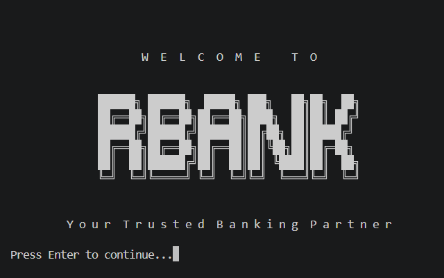
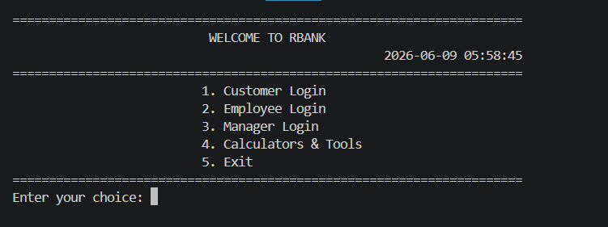
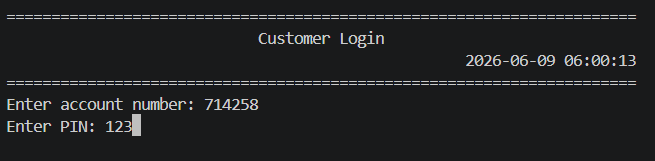
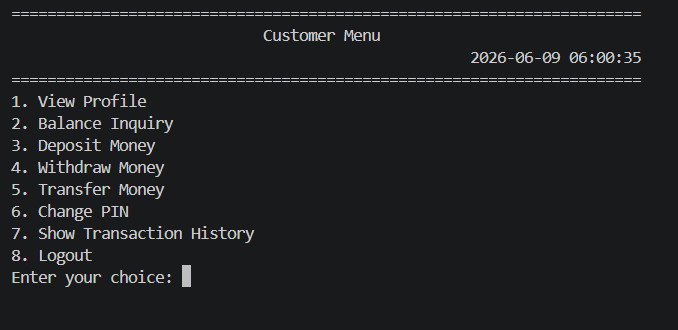
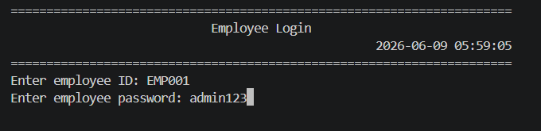
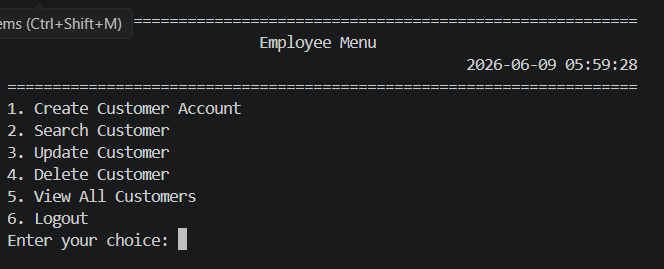
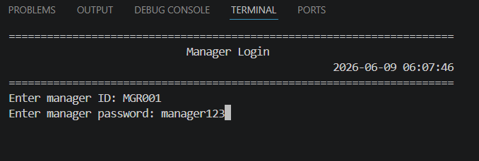
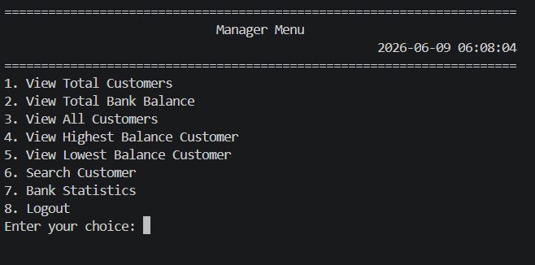
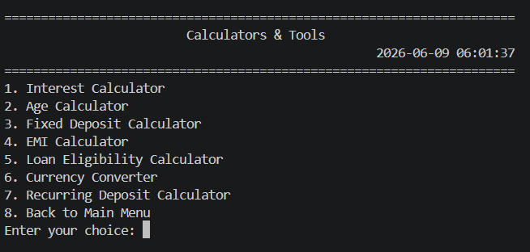
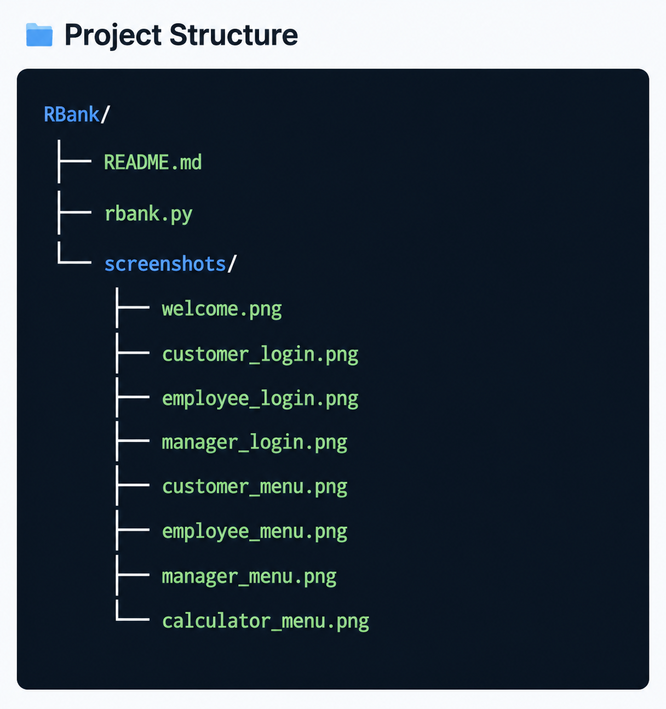

# 🏦 RBank – Console Based Banking Management System


RBank is a **Console-Based Banking Management System** developed using **Python**. The application simulates the core operations of a real-world banking system through a simple, interactive, and menu-driven interface.

The project provides separate modules for **Customers**, **Employees**, and **Managers**, allowing users to perform banking operations based on their roles. It also includes various **financial calculators**, utility tools, and an animated terminal interface to provide a professional user experience.

This project was developed to strengthen programming concepts such as **functions, loops, conditional statements, file handling, modular programming, authentication, and real-world problem solving using Python.**

---

# 📚 Table of Contents

- About the Project
- Features
- User Roles
- Technologies Used
- Project Structure
- Installation
- Running the Project
- Application Workflow
- Module Overview
- Banking Operations
- Security Features
- Screenshots
- Python Concepts Used
- Future Enhancements
- Team Contributions
- Author

---

# 📖 About the Project

RBank is a terminal-based banking application that allows users to perform common banking activities through an interactive menu-driven interface.

The application supports three different user roles:

- 👤 Customer
- 👨‍💼 Employee
- 👨‍💼 Manager

Each role has different permissions and responsibilities, making the project closely resemble the workflow of a real banking system.

Apart from banking operations, the application also provides useful banking calculators and utility tools.

---

# ✨ Features

## General Features

- Professional animated welcome screen
- Interactive menu-driven interface
- Secure login authentication
- Role-based access control
- Console-based UI
- Transaction history
- Date & time tracking
- Random account number generation
- Utility calculators
- Clean terminal formatting
- Input validation
- Error handling

---

## 👤 Customer Features

- Customer Login
- Balance Enquiry
- Deposit Money
- Withdraw Money
- Fund Transfer
- View Account Details
- Transaction History
- Change Password
- Logout

---

## 👨‍💼 Employee Features

- Employee Login
- Create Customer Account
- Search Customer
- Update Customer Details
- Deposit Amount
- Withdraw Amount
- Customer Assistance
- Logout

---

## 👨‍💼 Manager Features

- Manager Login
- Employee Management
- Customer Management
- Administrative Controls
- View Reports
- System Monitoring
- Logout

---

## 🧮 Calculators & Tools

- EMI Calculator
- Loan Calculator
- Simple Interest Calculator
- Compound Interest Calculator
- Banking Utility Functions
- Console Formatting Utilities

---

# 👥 User Roles

## 👤 Customer

Customers can perform day-to-day banking operations.

Permissions include:

- View Balance
- Deposit Money
- Withdraw Money
- Fund Transfer
- View Transactions
- Change Password

---

## 👨‍💼 Employee

Employees assist customers and manage banking records.

Responsibilities include:

- Create Customer Accounts
- Update Customer Information
- Search Customer Accounts
- Deposit & Withdrawal Assistance

---

## 👨‍💼 Manager

Managers supervise the complete banking system.

Responsibilities include:

- Administrative Operations
- Employee Management
- Customer Management
- Monitoring Banking Activities

---

# 💻 Technologies Used

- Python 3.x

### Python Modules

- os
- time
- random
- datetime

No external libraries are required.

---

# 📁 Project Structure

```
RBank/
│
├── rbank.py
├── README.md
│
└── screenshots/
    ├── Welcome.png
    ├── Main-menu.png
    ├── Customer_login.png
    ├── Customer_menu.png
    ├── Employee_login.png
    ├── Employee_menu.png
    ├── Manager_login.png
    ├── Manager_menu.png
    ├── Calculators_and_Tools.png
    └── Project_structure.png
```

---

# ⚙️ Installation

Clone the repository

```bash
git clone https://github.com/your-username/RBank.git
```

Move into the project folder

```bash
cd RBank
```

---

# ▶️ Running the Project

Execute the application using

```bash
python rbank.py
```

or

```bash
python3 rbank.py
```

depending on your Python installation.

---

# 🔄 Application Workflow

```
                 Start
                   │
                   ▼
        Animated Welcome Screen
                   │
                   ▼
              Main Menu
                   │
      ┌────────────┼─────────────┐
      ▼            ▼             ▼
 Customer      Employee      Manager
      │            │             │
      ▼            ▼             ▼
 Banking      Customer      Administrative
Operations    Management      Operations
                   │
                   ▼
          Calculators & Tools
```

---

# 🧩 Module Overview

## Welcome Screen

Displays

- Animated welcome text
- Banking banner
- Professional startup animation

---

## Authentication Module

Provides secure login for

- Customer
- Employee
- Manager

Each user accesses only the features assigned to their role.

---

## Customer Module

Responsible for customer banking operations.

Includes:

- Deposit
- Withdraw
- Fund Transfer
- Balance Enquiry
- Account Details
- Transaction History

---

## Employee Module

Handles customer management.

Functions include:

- Create Customer
- Search Customer
- Update Details
- Deposit Assistance
- Withdrawal Assistance

---

## Manager Module

Provides administrative controls.

Includes:

- Employee Management
- Customer Supervision
- Administrative Functions
- Reports

---

## Calculator Module

Provides financial utilities such as

- EMI Calculator
- Loan Calculator
- Interest Calculators
- Banking Utility Functions

---

# 💰 Banking Operations

### Deposit

Allows customers to add money into their account.

---

### Withdraw

Allows withdrawal after verifying sufficient balance.

---

### Fund Transfer

Transfers money securely between customer accounts.

---

### Balance Enquiry

Displays current account balance.

---

### Transaction History

Displays all transactions with date and time.

---

### Account Creation

Generates new customer accounts with unique account numbers.

---

# 🔐 Security Features

- Login Authentication
- Password Verification
- Role-Based Access Control
- Input Validation
- Secure Banking Operations
- Error Handling

---

# 🖼️ Screenshots

## Welcome Screen



---

## Main Menu



---

## Customer Login



---

## Customer Menu



---

## Employee Login



---

## Employee Menu



---

## Manager Login



---

## Manager Menu



---

## Calculators & Tools



---

## Project Structure



---

# 📘 Python Concepts Used

This project demonstrates practical implementation of:

- Variables
- Data Types
- Operators
- Conditional Statements
- Loops
- Functions
- Lists
- Dictionaries
- Strings
- File Handling
- Exception Handling
- Random Module
- Date & Time Module
- OS Module
- Time Module
- Menu-Driven Programming
- Authentication
- Input Validation
- Modular Programming
- Console UI Design

---

# 🚀 Future Enhancements

The following features can be added in future versions:

- SQLite / MySQL Database Integration
- Password Encryption
- OTP Verification
- Email Notifications
- ATM Simulation
- Debit & Credit Card Management
- QR Code Payments
- PDF Account Statements
- GUI Version using Tkinter
- Web Application using Flask/Django
- Mobile Banking Features
- REST API Integration

---

# 👥 Team Contributions

This project was developed collaboratively, with each team focusing on a specific module of the banking system.

| **Team Members** | **Module** | **Responsibilities** |
|------------------|------------|----------------------|
| **Pradeep**, **Ganesh**, **Deeven** | **Customer Module** | Designed and implemented customer-related functionalities including customer registration, login, account management, balance enquiry, deposits, withdrawals, fund transfers, transaction history, password management, and customer workflow. |
| **Basha**, **Maheen** | **Manager Module** | Developed the manager interface and administrative functionalities including manager authentication, employee management, customer supervision, administrative controls, and overall banking operations. |
| **Charan Teja**, **Gangamohan**, **Chaitanya** | **Employee Module** | Developed employee-related functionalities including employee authentication, customer account creation, account updates, customer search, deposits, withdrawals, and employee workflow management. |
| **Charan**, **Manikanta**, **Sanjay** | **Tools, Calculators & UI Formatting** | Developed financial calculators, banking utility tools, console formatting functions, animated welcome screen, menu layouts, banners, and overall user interface improvements. |

---

# 🙏 Acknowledgement

We sincerely thank every team member for their dedication, collaboration, and valuable contributions throughout the development of **RBank – Console Based Banking Management System**. This project reflects our collective effort in applying Python programming concepts to build a practical and interactive banking application.

---

# 👨‍💻 Author

**Cherry**

Python Developer | Full Stack Learner | Student

GitHub: https://github.com/charansomisetti144-eng

---

# ⭐ Support

If you found this project useful, please consider giving it a **⭐ Star** on GitHub. Your support motivates us to build more useful and educational projects.

---

## 📄 License

This project is created for **educational and learning purposes**. Feel free to use, modify, and improve it for academic or personal learning.